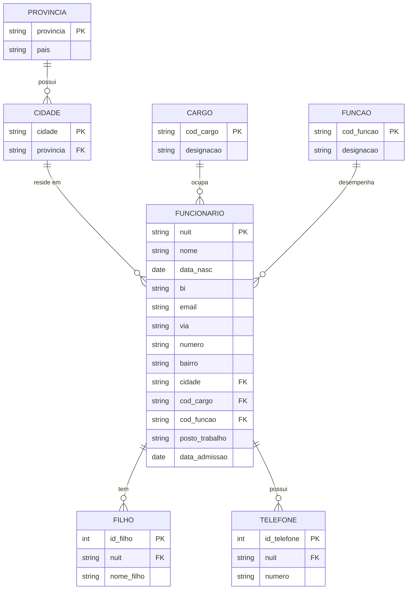

# Modelo Entidade-Relacionamento (MER)

> Ferramenta usada: **Mermaid** (renderiza automaticamente no GitHub). Se preferires, importa este mesmo esquema para o draw.io ou dbdiagram.io — a estrutura é idêntica.

